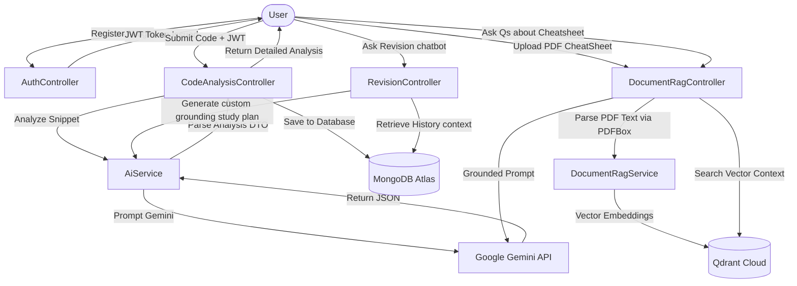

# AlgoRecall AI 🧠🚀

AlgoRecall AI is an AI-powered developer productivity tool built with Java 21, Spring Boot, Spring Security, MongoDB, and Spring AI (Google Gemini & Qdrant Cloud Vector Database). 

Instead of generating solutions, AlgoRecall AI acts as a **senior engineering mentor**—analyzing a programmer's code, diagnosing logical and structural issues, explaining *why* they happened, showing step-by-step corrections, and building a permanent history of mistakes and learning over time.

---

## 📖 Table of Contents
1. [Project Overview](#project-overview)
2. [Problem Statement & Why This Project Exists](#problem-statement--why-this-project-exists)
3. [Key Features](#key-features)
4. [Tech Stack](#tech-stack)
5. [Prerequisites](#prerequisites)
6. [Installation & Setup](#installation--setup)
7. [Environment Variables](#environment-variables)
8. [Project Workflow](#project-workflow)
9. [API Documentation](#api-documentation)
10. [Postman Testing Guide](#postman-testing-guide)
11. [Future Enhancements](#future-enhancements)

---

## 🌟 Project Overview

Developers often learn more from their bugs than from reading clean code. However, standard AI coding assistants are heavily focused on *code generation* (writing code for you), which bypasses the learning process.

**AlgoRecall AI** changes this dynamic. When you submit buggy code, the backend sends it to a structured Gemini model to generate a professional code review. The feedback includes mistake categorization, root-cause explanations, step-by-step logic corrections, and runtime/space complexity changes. Over time, you build a searchable personal learning history of mistakes. You can chat with the **AI Revision Assistant** to discover recurring bug patterns in your code. 

Additionally, a dedicated **Document RAG Assistant** allows you to upload text cheatsheets or PDF documents (using Apache PDFBox parsing) into a Qdrant Cloud Vector Database and query them semantically for targeted learning.

---

## ⚠️ Problem Statement & Why This Project Exists

1. **The Copy-Paste Trap**: Novices paste error messages directly into AI chat boxes to get quick solutions. This solves the immediate compiler block but results in low conceptual retention.
2. **Lack of Learning Notebooks**: Coding journals are rarely kept because writing down bugs, code versions, and explanations manually is time-consuming.
3. **No Aggregate Mistake Tracking**: There is no easy way to query your past coding history for patterns, such as *"Show me my typical Java recursion mistakes before I go to this interview."*

---

## ⚡ Key Features

* **Secure Authentication**: Secure sign-up/login powered by Spring Security and JWT. Hashed password storage with BCrypt.
* **Mentoring Code Analysis**: Deep code reviews with root causes, explanations, complexity analysis (Big O), best practices, and optimized drop-in replacements.
* **Personal Learning Journal**: Permanently log code submissions, add personal learning notes, bookmark crucial reviews, search by keywords, and delete records.
* **Real-time Analytics Dashboard**: Aggregate stats (total logs, bookmarks, favorite programming language, most common error category, and quick links to recent reviews).
* **AI Revision Assistant**: Query your history using retrieval-augmented logic, allowing you to ask questions like *"What concurrency mistakes do I repeat?"* or *"Summarize my Java mistakes."*
* **Isolated Document RAG**: Upload study cheatsheets or PDF files. Text content is parsed (via PDFBox), split into semantic overlapping chunks, indexed in Qdrant Cloud, and queried using Google GenAI Embeddings.

---

## 🛠️ Tech Stack

* **Java 21** (Modern LTS runtime)
* **Spring Boot 4.1.0** (Core framework)
* **Spring AI 2.0.0** (Google Gemini & Qdrant integration)
* **Google Gemini 2.5 Flash** (LLM for text generation)
* **Google text-embedding-004** (Vector embedding mapping)
* **Qdrant Cloud** (Managed vector database for semantic search)
* **Apache PDFBox 2.0.31** (Text extraction from PDF files)
* **Spring Security 6.x** (Stateless authentication filters)
* **JWT (io.jsonwebtoken 0.12.5)** (Token management)
* **Spring Data MongoDB** (Database driver mapping)
* **MongoDB Atlas** (Cloud document store)
* **Maven** (Build and dependency system)
* **Lombok** (Boilerplate reduction)
* **Bean Validation** (Input payload filtering)

---

## 📋 Prerequisites

* **Java Development Kit (JDK) 21**
* **Apache Maven 3.6+**
* A **MongoDB Atlas account** (or a local MongoDB instance running on port `27017`)
* A **Google Gemini API Key** (obtained from Google AI Studio)
* A **Qdrant Cloud API Key and Host URL** (obtained from Qdrant Cloud Console)

---

## ⚙️ Installation & Setup

### 1. Clone & Navigate
```bash
git clone <repository-url>
cd AlgoRecall
```

### 2. Configure Environment Variables
You do **not** need to modify the configuration file itself. Standard properties in `src/main/resources/application.yml` pull values from environment variables. Set the following variables on your machine:

```bash
# Database Configurations
export MONGODB_URI="mongodb+srv://<user>:<pw>@cluster.mongodb.net/algorecall_db"

# Google Gemini Configurations
export GOOGLE_API_KEY="AIzaSyD..."
export GOOGLE_PROJECT_ID="your-project-id"

# Qdrant Vector DB Configurations
export QDRANT_API_KEY="your-qdrant-api-key"
export QDRANT_HOST="your-qdrant-cluster-url.aws.cloud.qdrant.io"
export QDRANT_PORT="6334"

# Security Configurations
export JWT_SECRET="your_secure_256bit_minimum_secret_string"
```

### 3. Build the Project
Use the Maven wrapper to compile the application and download dependencies (including PDFBox and Qdrant drivers):
```bash
mvn clean install
```

### 4. Run the Application
Start the Spring Boot server:
```bash
mvn spring-boot:run
```
The application will start on port `8080`.

---

## 🔄 Project Workflow



---

## 🌐 API Documentation

All endpoints (except auth) require a header: `Authorization: Bearer <your_jwt_token>`.

### 1. Authentication Endpoints

#### `POST /api/auth/register` (Register User)
* **Sample Request**:
```json
{
  "email": "user@example.com",
  "password": "secretpassword"
}
```
* **Sample Response (200 OK)**:
```json
{
  "token": "eyJhbGciOiJIUzI1NiJ9.eyJzdWIiOiJ1c2VyQGV4YW1wbGUuY29tIiwiaWF0IjoxNzgxNjA0ODAwLCJleHAiOjE3ODE2OTEyMDB9...",
  "email": "user@example.com"
}
```

#### `POST /api/auth/login` (Login User)
* **Sample Request**:
```json
{
  "email": "user@example.com",
  "password": "secretpassword"
}
```
* **Sample Response (200 OK)**:
```json
{
  "token": "eyJhbGciOiJIUzI1NiJ9.eyJzdWIiOiJ1c2VyQGV4YW1wbGUuY29tIiwiaWF0IjoxNzgxNjA0ODAwLCJleHAiOjE3ODE2OTEyMDB9...",
  "email": "user@example.com"
}
```

---

### 2. Code Analysis Endpoints

#### `POST /api/analyses` (Analyze Code)
Submits a buggy code snippet for AI diagnosis.
* **Sample Request**:
```json
{
  "sourceCode": "public int binarySearch(int[] arr, int target) {\n    int low = 0;\n    int high = arr.length - 1;\n    while (low <= high) {\n        int mid = (low + high) / 2;\n        if (arr[mid] == target) return mid;\n        else if (arr[mid] < target) low = mid;\n        else high = mid;\n    }\n    return -1;\n}",
  "userPrompt": "Stuck in an infinite loop when the target is not present or boundary conditions are reached."
}
```
* **Sample Response (201 Created)**:
```json
{
  "id": "667d7cb9e28f3a3f5a1a1234",
  "userId": "667d7cb1e28f3a3f5a1a0000",
  "title": "Java Binary Search Infinite Loop",
  "language": "Java",
  "category": "DSA",
  "problemStatement": "Implement a binary search that finds the element in a sorted array.",
  "sourceCode": "public int binarySearch(int[] arr, int target) { ... }",
  "expectedBehaviour": "Finds element or returns -1 in O(log N) time without crashing.",
  "actualBehaviourOrError": "Stuck in an infinite loop when target not present...",
  "overallSummary": "The Binary Search logic leads to an infinite loop because the pointers 'low' and 'high' are assigned 'mid' directly rather than 'mid + 1' or 'mid - 1', causing zero shrinkage of the search window.",
  "mistakeCategory": "Logical Error",
  "rootCause": "Direct assignment of bounds low = mid and high = mid instead of low = mid + 1 and high = mid - 1.",
  "whyMistakeHappened": "When low and high are consecutive, low <= high is true. If target is not found, mid is calculated as low. Setting low = mid results in no progress, creating an infinite loop.",
  "explanation": [
    "Step 1: Pointers low and high represent boundaries.",
    "Step 2: Mid calculation truncates dividing low and high.",
    "Step 3: If target is not at mid, boundaries must contract by stepping past mid to narrow search space."
  ],
  "suggestedImprovements": "Change 'low = mid' to 'low = mid + 1' and 'high = mid' to 'high = mid - 1'. Use mid = low + (high - low) / 2 to avoid potential integer overflow.",
  "optimizedCode": "public int binarySearch(int[] arr, int target) { ... }",
  "timeComplexity": "Original: O(infinity) due to loop / Optimized: O(log N)",
  "spaceComplexity": "Original: O(1) / Optimized: O(1)",
  "bestPractices": [
    "Always shift low/high boundaries strictly past mid to guarantee loop progression.",
    "Prevent integer overflow by calculating mid as low + (high - low) / 2."
  ],
  "learningTips": [
    "Trace small arrays (e.g. 2 elements) by hand to catch binary search edge cases."
  ],
  "revisionNotes": "In binary searches, low pointer must be mid + 1 and high pointer must be mid - 1.",
  "confidenceLevel": "HIGH",
  "bookmarked": false,
  "userNotes": "",
  "createdAt": "2026-06-27T15:30:17.581Z"
}
```

#### `GET /api/analyses` (Get History)
Returns all submission records. Supports search and filters.
* **Query Parameters**:
  * `keyword` (Optional): Search term matching title, summary, language, category, etc.
  * `bookmarked` (Optional): Filter by `true`/`false`.
  * `language` (Optional): Filter by programming language (e.g. `Java`, `Python`).
* **Sample Response (200 OK)**:
```json
[
  {
    "id": "667d7cb9e28f3a3f5a1a1234",
    "title": "Java Binary Search Infinite Loop",
    "language": "Java",
    "category": "DSA",
    "bookmarked": true,
    "createdAt": "2026-06-27T15:30:17.581Z"
  }
]
```

#### `PUT /api/analyses/{id}/notes` (Add/Edit Personal Notes)
Saves personalized notes to compile takeaways.
* **Sample Request**:
```json
{
  "userNotes": "Need to revise this binary search boundary logic before coding interviews!"
}
```
* **Sample Response (200 OK)**:
```json
{
  "id": "667d7cb9e28f3a3f5a1a1234",
  "userNotes": "Need to revise this binary search boundary logic before coding interviews!"
}
```

---

### 3. AI Revision Assistant Endpoints

#### `POST /api/revision/ask` (Query Assistant)
Ask conceptual or reflective questions grounded on your personal coding mistakes.
* **Sample Request**:
```json
{
  "question": "What mistakes do I repeat in Java?"
}
```
* **Sample Response (200 OK)**:
```json
{
  "answer": "Based on your AlgoRecall history, you tend to make recurring **Logical Errors** in Java, specifically related to boundaries: \n\n1. In your **Java Binary Search Infinite Loop** log, you forgot to decrement/increment boundary pointers past the midpoint, causing infinite loop issues.\n\n**Study Plan**: Focus on edge boundary calculations, index limits, and recursive termination clauses."
}
```

---

### 4. Document RAG Assistant Endpoints

#### `POST /api/documents/upload/pdf` (Upload PDF Cheatsheet)
Accepts a PDF document, parses it in the backend via Apache PDFBox, splits the text into semantic chunks, and indexes the vector embeddings in Qdrant Cloud.
* **Content-Type**: `multipart/form-data`
* **Body Form-Data Parameter**:
  * `file`: `[Select PDF File]`
* **Sample Response (200 OK)**:
```json
"PDF document parsed and indexed successfully."
```

#### `POST /api/documents/query` (Query Uploaded Documents)
Perform a semantic search on Qdrant Cloud over your uploaded context, and get a grounded answer from Gemini.
* **Sample Request**:
```json
{
  "question": "Why should I avoid Executors.newFixedThreadPool?"
}
```
* **Sample Response (200 OK)**:
```json
{
  "answer": "According to the Java Concurrency Cheat Sheet PDF context, you should avoid Executors.newFixedThreadPool because it utilizes an unbounded LinkedBlockingQueue which can grow indefinitely under load, leading to OutOfMemoryErrors."
}
```

---

### 5. Error Response Format (Global Exception Handling)

#### Sample Validation Error (400 Bad Request)
```json
{
  "status": 400,
  "message": "Validation failed",
  "timestamp": "2026-06-27T15:31:00Z",
  "errors": [
    "Please provide a valid email address"
  ]
}
```

---

## 🧪 Postman Testing Guide

1. **User Sign Up**: Send `POST` to `/api/auth/register` with JSON body email & password.
2. **User Login**: Send `POST` to `/api/auth/login` to retrieve JWT `token`.
3. **Authorization Header**: Copy the token, and add it as a `Bearer Token` to all subsequent headers: `Authorization: Bearer <TOKEN>`.
4. **Code Submission**: Send `POST` to `/api/analyses` with `sourceCode` & optional `userPrompt`.
5. **PDF Upload**: Send `POST` to `/api/documents/upload/pdf`. Set type as `form-data`, add parameter `file` of type `File`, select your PDF, and send.
6. **PDF Querying**: Send `POST` to `/api/documents/query` with your JSON question payload.

---

## 🚀 Future Enhancements

1. **OAuth2 Integrations**: Connect with Github/Google login.
2. **IDE Plugins**: Direct submit plugins for VS Code and IntelliJ IDEA.
3. **LeetCode Integration (Browser Extension)**: Develop a browser extension/plugin that allows users to submit their LeetCode solutions directly to the application, linking LeetCode attempts to their personal mentoring journal automatically.
4. **Batch Log Export**: PDF/Markdown export of mistake histories for offline interview prep.

